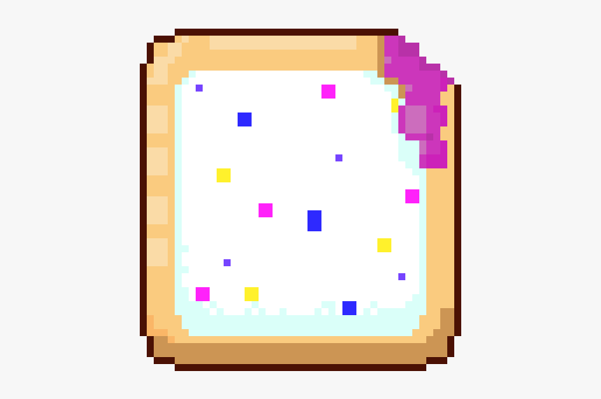

`poptart` is a multi-platform CLI tool for sending notifications, including local OS level notifications (toasts) and webhook calls.

Poptart is indend for use in automated scripts and processes where you'd like to notify a user or system that the process has hit some milestone, such as completing a build process.